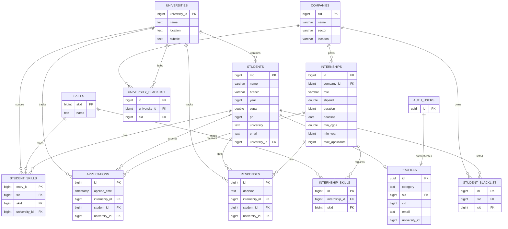

# InternLink
## About this project

InternLink is a unified internship platform that connects three key stakeholders in one system: students, companies, and universities.

Students can discover internship opportunities, apply to roles, and track the status of their applications over time.

Companies can publish opportunities, review applicants, make hiring decisions (accept, waitlist, or reject), and maintain blacklist controls when needed.

Universities get a centralized view of student internship activity, including which opportunities students from their institution have applied to and how engagement is progressing.

## Techstack used

- React for building reusable UI components and dashboard screens.
- Vite for fast local development and build tooling.
- JavaScript (ES6+) for application logic and async workflows.
- Supabase for backend services including authentication, API access, and database integration.
- PostgreSQL (via Supabase) for relational data storage and schema-driven design.

## What I learnt

- I learned what `async` and `await` mean in JavaScript and how they help write clearer asynchronous code when working with API calls.
- I learned React hooks like `useState` and `useMemo`.
- My understanding of `useState` is that it helps store frontend state and trigger UI updates when async data arrives, instead of manually re-rendering or repeatedly refetching data.
- I learned that `useMemo` helps avoid unnecessary recalculations by memoizing derived values when dependencies do not change.
- Through Supabase, I learned practical concepts in PostgreSQL, database design, authentication flow, API calling patterns, and Row Level Security (RLS) policies.

## Database schema



## Setup flow

### 1. Prerequisites

- Node.js 18+ (recommended: latest LTS)
- npm (comes with Node.js)
- A Supabase project with URL and publishable key

### 2. Install dependencies

```bash
npm install
```

### 3. Create environment file

Create a `.env.example` file in the project root with the following content:

```bash
VITE_SUPABASE_URL=your_supabase_project_url
VITE_SUPABASE_PUBLISHABLE_DEFAULT_KEY=your_supabase_publishable_key
```

Then create your local env file from it:

```bash
cp .env.example .env
```

Update `.env` with real values from your Supabase project settings.

### 4. Start development server

```bash
npm run dev
```

Open the local URL shown in the terminal (usually `http://localhost:5173`).

### 5. Build for production (optional)

```bash
npm run build
npm run preview
```

## Future growth

- Resume PDF ingestion and structured extraction.
- Richer internship/job detail pages for better role clarity.
- AI-generated internship summary for students (LLM).
- AI-generated student profile summary for recruiters (LLM).
- AI-based selection likelihood insights for students.

Planned AI direction: use LLM + RAG across intelligence features, with RAG-first design for resume understanding and retrieval.
